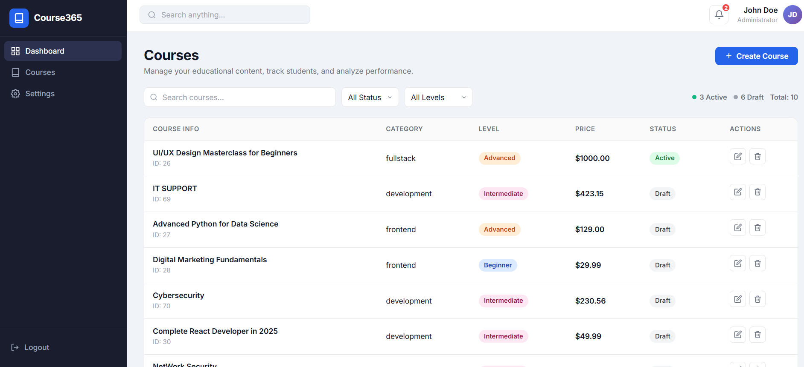

# Course365 v1.0 – Course Management Dashboard

## Giới thiệu

**Course365 v1.0** là ứng dụng quản lý khóa học được xây dựng bằng React, cung cấp giao diện trực quan để quản lý danh sách khóa học.

Ứng dụng cho phép người dùng thực hiện đầy đủ các chức năng **CRUD (Create, Read, Update, Delete)**, tìm kiếm, lọc dữ liệu và thống kê khóa học theo đúng thiết kế (UI Design). Dữ liệu được lấy từ API và hiển thị theo thời gian thực.

---

# Giao diện

### Danh sách khóa học

> Thêm ảnh screenshot của trang Course List vào đây.

```markdown

```

### Giao diện Dashboard

```markdown

```

---

# Tính năng

Ứng dụng hỗ trợ các chức năng sau:

* Hiển thị danh sách khóa học từ API.
* Thêm khóa học mới.
* Chỉnh sửa thông tin khóa học.
* Xóa khóa học.
* Tìm kiếm khóa học theo tên.
* Lọc khóa học theo điều kiện.
* Hiển thị thống kê số lượng khóa học.
* Giao diện Responsive theo thiết kế.

---

# Công nghệ sử dụng

* React
* JavaScript (ES6+)
* Bootstrap 5
* Axios / Fetch API
* JSON Server (Fake API)
* Vite

---

# Cài đặt và chạy project

## 1. Clone source

```bash
git clone <link-gitlab>
```

## 2. Cài đặt thư viện

```bash
npm install
```

## 3. Khởi động Fake API

```bash
npm run server
```

## 4. Chạy ứng dụng

```bash
npm run dev
```

Mặc định ứng dụng sẽ chạy tại:

```
http://localhost:5173
```

---

# Build Project

Để build project:

```bash
npm run build
```

Nếu build thành công sẽ tạo thư mục:

```
dist/
```

---

# Live Demo

Link demo sau khi deploy lên Vercel hoặc Netlify:

*(https://fanciful-pasca-316be7.netlify.app/courses)*

---

# Cấu trúc thư mục

```text
Course365/
│
├── public/
├── src/
│   ├── components/
│   ├── pages/
│   ├── services/
│   ├── assets/
│   └── App.jsx
│
├── screenshots/
│   ├── course-list.png
│   └── dashboard.png
│
├── package.json
└── README.md
```

---

# Kết quả

* CRUD hoạt động ổn định.
* Tìm kiếm và lọc dữ liệu chính xác.
* Giao diện Responsive.
* Build thành công.
* Deploy thành công trên Vercel/Netlify.
* Không có lỗi JavaScript trên trình duyệt.

---

# Tác giả

Thực hiện trong quá trình học React - Course365 Dashboard.

© 2026 Course365. All rights reserved.